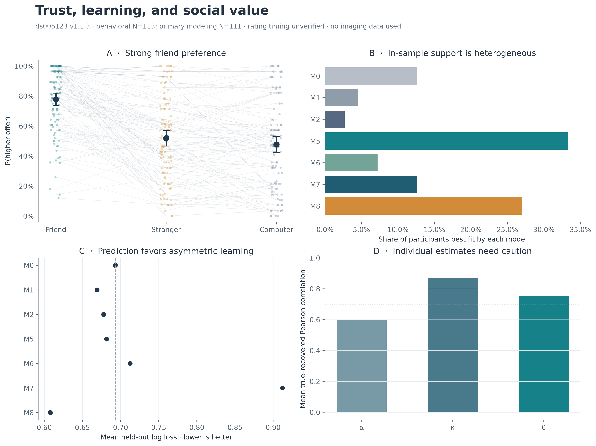

# Trust, learning, and social value

> **Second pass incomplete (25 September 2026).** Linux completed 31 of 34 posterior runs with passing diagnostics. Three fits each retain one divergence and block final reporting. The laptop jobs have been terminated. Read the [handoff](docs/linux1_handoff.md) and [current status](results/second_pass_checkpoint.md). The report/gallery below still contain the historical first pass; some hierarchical outputs remain provisional.

A reproducible behavioral analysis of **OpenNeuro ds005123 v1.1.3**. Does greater trust in friends reflect added value of reciprocation, optimistic expectations, asymmetric learning, or more general partner preferences?



## Results

Read the [analysis report](results/analysis_summary.md), browse the [figures](results/figures), or inspect [tables](results/tables). Figures are available as 320-dpi PNG plus vector PDF and SVG.

The released sample has 114 participants; 113 have auditable Trust behavior and 111 enter primary computational analyses. Friends elicit higher investment. The second pass shows that raising the social-value ceiling from 5 to 10 does not resolve weak parameter scaling. Behavioral age moderation and joint hierarchical H5 age effects remain uncertain. Hierarchical models are compared with generic partner preferences and asymmetric learning through temporal prediction, full posterior predictive simulations, and paired recovery. Ratings are **not verified as pre-task**. Read the report for model comparisons and uncertainty; a fit advantage alone does not establish a uniquely social-reward mechanism.

This is a model-based secondary analysis, not a preregistered confirmation. Numerical findings and uncertainty are generated from the pipeline rather than hand-edited tables.

## Data and scientific motivation

- Dataset: [ds005123 v1.1.3](https://doi.org/10.18112/openneuro.ds005123.v1.1.3), commit `a3213b56b7bd27d7e3ac10577558eb26bb7c2a61`.
- Dataset article: [Smith et al. (2024), Data in Brief](https://doi.org/10.1016/j.dib.2024.110810).
- Conceptual starting point: [Fareri, Chang & Delgado (2015)](https://doi.org/10.1523/JNEUROSCI.4775-14.2015).
- [Task audit and exclusions](docs/data_audit.md); [model equations and fitting](docs/models.md).

**Imaging data are unnecessary. No imaging content is downloaded or analyzed.** The installer clones DataLad metadata, selects the exact release, and retrieves only explicitly listed small behavioral/source files. Imaging symlink placeholders may exist in the ignored dataset checkout; their content remains unfetched. Raw data and source papers are not committed to this repository.

## Installation

Python 3.11+; the recorded analysis used Python 3.13 on macOS ARM. Install DataLad and git-annex separately (for example, `brew install datalad git-annex` on macOS), then:

```bash
python3 -m venv .venv
source .venv/bin/activate
python -m pip install -r requirements.lock.txt
python -m pip install -e '.[test]'
bash scripts/00_install_data.sh
```

`requirements.lock.txt` records exact Python package versions from the execution environment. `pyproject.toml` supplies portable minimum constraints if an exact wheel is unavailable on another platform. Version differences should be recorded and numerical results compared. The download script never invokes `datalad get` on a directory; **do not run `datalad get .`**.

## Reproduce everything

```bash
bash scripts/99_run_all.sh
```

This runs unit tests, validates/reconstructs the canonical decision table, performs behavioral analysis, fits models and prospective predictions, evaluates robustness, executes recovery and simulation checks, regenerates figures/report/provenance, and validates results. The dataset must already be installed. Six worker processes are used; set `jobs` in `config/analysis.json` for your machine. Core, held-out, and robustness fits use 100 starts. Parameter recovery uses 50 repetitions per participant/model and 50 starts per refit. Model recovery uses two repetitions per participant/generator across 12 models (206 datasets per generator on this sample). Predictive checks use 200 repetitions. Expect tens of minutes on a modern multicore computer, longer on slower hardware; compilation adds overhead on first execution.

Intermediate logs are in ignored `work/`. The historical pipeline recomputes results without silently reusing cached fits; the optional hierarchical pipeline explicitly reuses validated chain caches as described below. The configuration contains all statistical seeds and repetition counts. Simulated choices are stochastic; programmed outcomes are revealed only after simulated positive investments. Missing response patterns remain fixed in recovery.

## Models

For investment `x` out of an $8 endowment:

```text
V_money(x) = 8 - x + 1.5*x*P_partner
V_social(x) = 8 - x + P_partner*x*(1.5 + theta*S_partner)
P(high) = logistic(kappa * (V_high - V_low))
P_partner <- P_partner + alpha*(observed_reciprocation - P_partner)
```

Updates occur only after observed feedback. A zero investment and a missed decision produce no update. Multiplying social value by investment magnitude makes it affect positive-versus-positive offers, unlike a constant partner bonus that would cancel.

| Model | Account |
| --- | --- |
| M0 | Random choice |
| M1 | Fixed monetary EV, P=.5 |
| M2 | Ordinary monetary RL |
| M3 | Rating-initialized expectations; secondary |
| M4 | Rating-weighted reciprocation value; secondary |
| M5 | Friend-specific reciprocation value |
| M6 | Common human-partner reciprocation value |
| M7 | Separate friend/stranger values, computer reference |
| M8 | Positive/negative learning rates |

Controls test signed bonuses, side bias, lapse, resetting beliefs, rating centering, wider temperature bounds, monetary curvature, and partner preferences independent of feedback probability. See [full definitions](docs/models.md).

## Repository organization

```text
config/                     seeds, fit and simulation counts
src/rf1_trust_socialvalue/   audit, behavior, models, estimation, recovery, figures
scripts/                    numbered pipeline and output validation
tests/                      analytical learning, payoff, likelihood and data tests
docs/                       modeling decisions and data audit
results/figures/            PNG, PDF, SVG
results/tables/             derived trial table, fit/recovery/behavioral outputs
results/analysis_summary.md complete scientific report
results/provenance.json     exact software, dataset/analysis commits and source hashes
data/                       ignored source dataset; never published
work/                       ignored logs and local caches
```

## Important reading notes

The in-sample mean criterion winner, most frequent individual winner, and held-out winner differ. Comparisons involving ratings use complete cases throughout. Recovery correlations measure empirical-distribution recovery, not universal identifiability. First-pass plug-in simulation intervals omit parameter uncertainty; hierarchical predictive intervals propagate posterior uncertainty. Age analyses are exploratory and continuous. Behavioral contrast tests receive multiplicity correction; hierarchical credible intervals and posterior sign probabilities do not. Raw theta remains weakly identified even after regularization. See the report before interpreting parameters.

The analysis-source commit is recorded in provenance; the subsequent generated-results commit contains the report. This avoids pretending a Git commit can contain its own final hash. The input manifest records exact small source files. `scripts/07_validate_outputs.py` verifies that imaging content remains unfetched and no raw-data directory is tracked.


## Second-pass analysis

The original audited dataset and samples are unchanged. Historical tables remain available; the revised nonhierarchical primary estimates are in `results/tables/model_fits_theta10.csv`. Explicit 5/10/20 comparisons are in `theta_bound_sensitivity.csv`. H-prefixed outputs are joint Bayesian fits, and ratings remain secondary with timing unverified. The report distinguishes behavioral age moderation, computational age effects, and mechanism.

Optional environment and full workflow:

```bash
.venv/bin/python -m pip install -e '.[hierarchical,test]'
.venv/bin/python -c 'import cmdstanpy; cmdstanpy.install_cmdstan(version="2.40.0", dir="work/cmdstan", cores=4)'
bash scripts/98_run_hierarchical.sh
```

`requirements-hierarchical.lock.txt` records the tested optional environment. Sampling starts with 4 chains × (2,000 warmup + 2,000 retained draws). Mixing failures can extend to 3,000 warmup + 8,000 retained draws per chain, or 16,000 retained draws if a population correlation still fails the threshold. Expect several hours for the complete full-data, training-only, sensitivity and recovery workflow; runtime depends on hardware and diagnostic retries. Chains/builds are ignored under `work/`. Completed fits resume from manifests and actual sampler settings; diagnostic failures are preserved and retried at adapt_delta=.99. Do not delete the cache if you intend to resume. Changed model/data/settings fingerprints stop stale reuse.

Individual steps: `08_bound_sensitivity.py`, `08_age_behavior.py`, `09_fit_hierarchical.py --model H5`, `12_run_hierarchical_suite.py`, `10_hierarchical_validation.py`, `14_finalize_hierarchical.py`, `11_hierarchical_figures.py`, and `13_validate_second_pass.py --hierarchical`. The finalizer refreshes summaries, predictive scoring, traces, paired comparisons and `results/hierarchical_provenance.json` from the validated posterior caches. The published continuation utility documents how the full preference fit reused completed adaptation; its fresh retained draws and provenance are checked against the unchanged chain files. The historical full pipeline accepts `--hierarchical` to invoke the second pass afterward. Run `.py` validation scripts with Python, not Bash.
