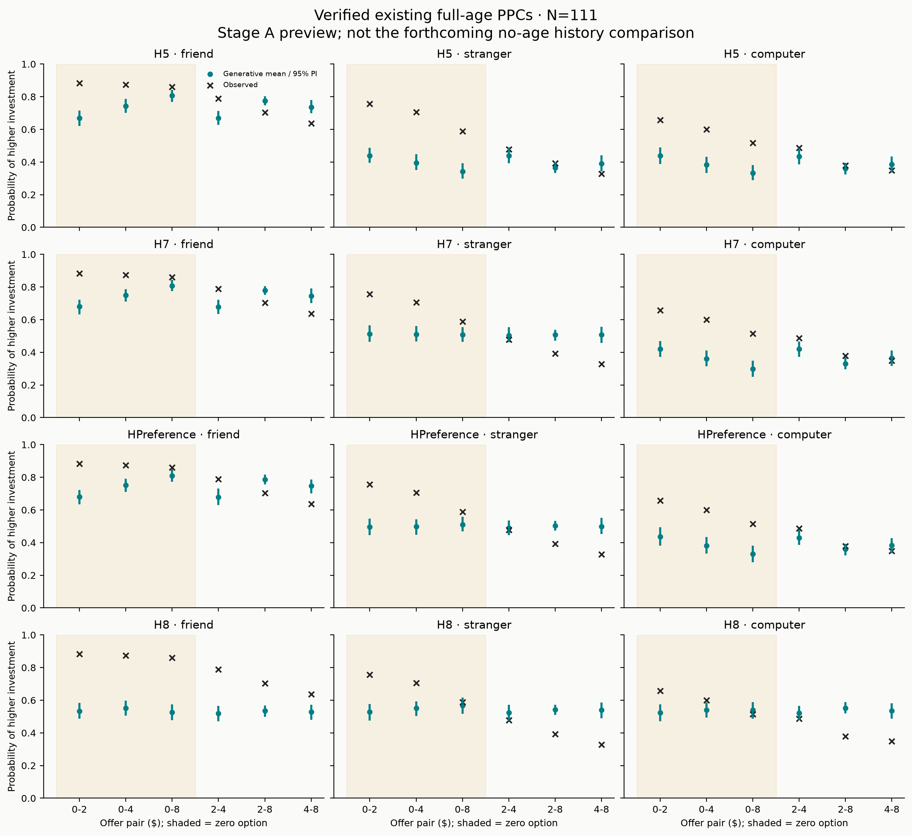

# N=111 closeout — diagnostic stage prepared

**Closeout incomplete: awaiting the no-age history diagnostic on linux1.** The [fixed brief](../../docs/n111_wrapup_scope.md) and [decision record](../../docs/n111_wrapup_decisions.md) define the finite scope. No additional participant data have been accessed, no new fits have been started, and H4_full_age / H5_train_age remain excluded. The [accepted-fit report](../review/README.md) and caches are preserved.

The motivating zero-option pattern is verified directly from the accepted, committed full-age PPC outputs. HPreference computer trials:

| offer_pair | observed | mean | ci_low | ci_high | residual_high |
| --- | --- | --- | --- | --- | --- |
| 0-2 | 0.658 | 0.437 | 0.382 | 0.495 | 0.221 |
| 0-4 | 0.601 | 0.381 | 0.334 | 0.435 | 0.220 |
| 0-8 | 0.516 | 0.330 | 0.280 | 0.382 | 0.185 |
| 2-4 | 0.487 | 0.430 | 0.385 | 0.480 | 0.057 |
| 2-8 | 0.379 | 0.360 | 0.321 | 0.393 | 0.019 |
| 4-8 | 0.350 | 0.383 | 0.335 | 0.428 | -0.033 |

H5 and H7 show similar computer zero-option underprediction. H8 shows a different pattern, including overprediction on large positive-positive offers. This existing full-age check does not establish whether the discrepancy persists under actual histories, or whether a generic zero-option term improves prospective performance.

Shading marks zero-containing offers. Black crosses show observations; teal points/intervals show existing generative means and 95% predictive intervals. The plot is a verification of prior outputs, not newly fitted no-age results. [Source values](tables/published_offer_check.csv) and [provenance](published_check_provenance.json) are available. PDF and SVG accompany the PNG.

## Next execution

Follow the [Linux commands](../../docs/n111_linux.md). Stage A reads the five accepted no-age training posterior caches, computes both history predictions, produces matched residual tables and figures, and stops without sampling. The main figures use held-out trials; all/training/held-out table rows are labeled separately. No automatic model-extension or recovery run follows this command.

Zero-option retention, realistic H7-versus-HPreference recovery, and the final synthesis remain pending. No placeholders are presented as estimates for these unrun analyses.

## What should carry forward to the full dataset

No final new modeling decision is available yet. Preserve the fixed sample/trial conventions, accepted diagnostics, unresolved rating timing, and age uncertainty while completing the scoped diagnostic. There are no instructions here to access or import additional participants.
