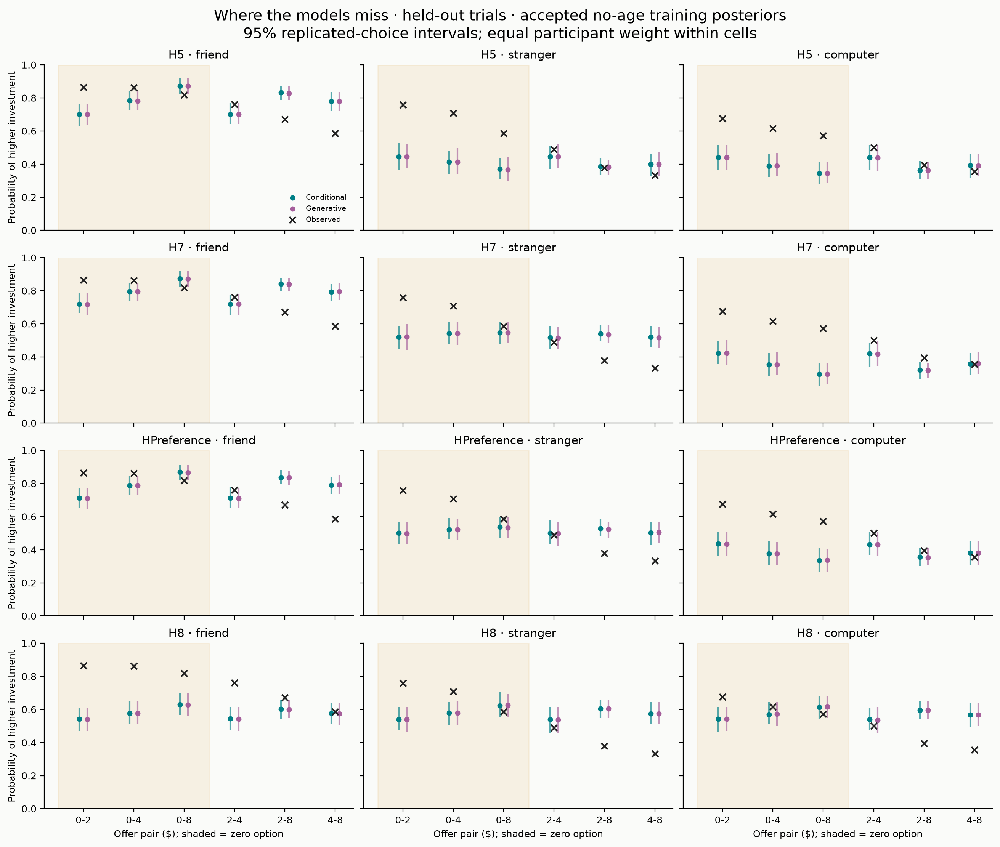
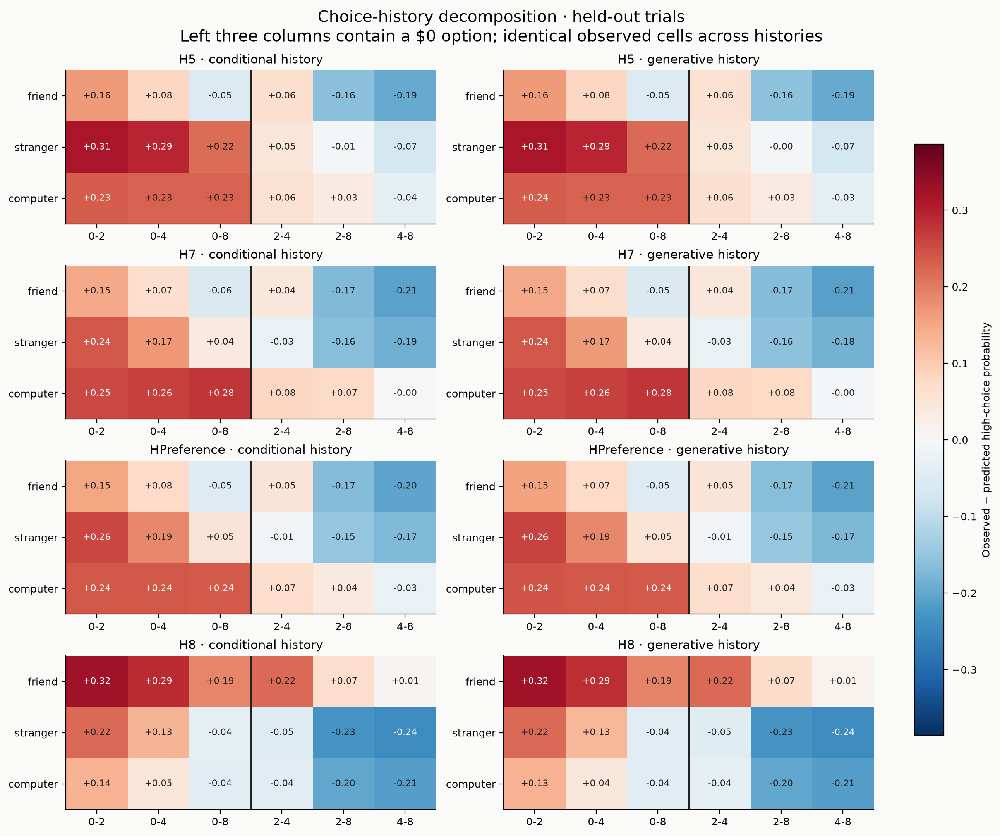

# N=111 closeout — history diagnostics and zero-option comparison

**Closeout in progress.** Stage A is complete; the first stage-B batch has 11/12 accepted fits. Read the [zero-option batch review](zero_option_initial_review.md): all four training extensions improve temporal prediction, H5/H7 zero-offer PPCs improve markedly, positive-positive changes are mixed, and existing value parameters shift. The full-data HPreference extension is excluded for eight depth hits; [one reviewed retry](../../docs/n111_zero_retry.md) is prepared. Retention and realistic recovery remain pending.

## Stage A history diagnostics

These outputs use the five accepted no-age TRAINING posteriors. The two excluded fits remain excluded. No new sampling or additional participant data were used. The [accepted-fit review](../review/README.md) is preserved.

The primary figures use the 4,017 held-out choices. Tables also distinguish all 8,251 valid choices and the 4,234 training choices; all-trial summaries include in-sample decisions and must not be described as prospective performance. Parameters stay fixed at their training posterior. Conditional predictions replay actual pretrial feedback; generative predictions simulate feedback exposure from the beginning of each participant's sequence. Thus the comparison includes divergence of simulated training histories as well as held-out histories.

Conditional predictive means average choice probabilities over posterior draws. Their predictive intervals use independent Bernoulli replications that do not affect subsequent feedback exposure. Generative means and intervals use simulated choices whose feedback changes subsequent beliefs. Intervals are pointwise replicated-choice intervals, not confidence intervals on residuals; no multiplicity correction is applied. Both retain the same posterior draw indices and observed cell definitions.

History-stratified cells use the actual PRETRIAL same-partner feedback label for both prediction types so the compared observed subsets are identical. The actual label is used only for grouping, never to update a generative belief. These are fixed-observed-stratum diagnostics, not a replication of the distribution of simulated feedback-category membership. Run 1/2 cells include the 90 two-run participants; 21 single-run participants are identified separately. Early/middle/late bins use chronological thirds of each participant's full sequence including missed trials. Cells with fewer than 20 participants are retained and flagged, not given equal evidential weight.

## Zero-option residual contrast

Computer trials in the held-out period, paired within participants who contribute both zero and positive-positive offers. Positive values mean greater underprediction for zero-containing offers. The bootstrap resamples participants (5,000 draws), conditional on the posterior prediction estimates. It is descriptive, not a causal effect of presenting zero, and does not match exact offer amounts.

| model | prediction_type | n_paired_participants | zero_residual_high | positive_positive_residual_high | zero_minus_positive_residual | ci_low | ci_high |
| --- | --- | --- | --- | --- | --- | --- | --- |
| H2 | conditional_history | 110 | 0.143 | -0.055 | 0.197 | 0.132 | 0.262 |
| H2 | generative_history | 110 | 0.148 | -0.055 | 0.203 | 0.139 | 0.267 |
| H5 | conditional_history | 110 | 0.229 | 0.030 | 0.199 | 0.136 | 0.262 |
| H5 | generative_history | 110 | 0.229 | 0.030 | 0.198 | 0.134 | 0.262 |
| H7 | conditional_history | 110 | 0.263 | 0.064 | 0.199 | 0.133 | 0.264 |
| H7 | generative_history | 110 | 0.264 | 0.064 | 0.199 | 0.135 | 0.266 |
| H8 | conditional_history | 110 | 0.043 | -0.158 | 0.201 | 0.136 | 0.266 |
| H8 | generative_history | 110 | 0.043 | -0.157 | 0.200 | 0.136 | 0.266 |
| HPreference | conditional_history | 110 | 0.236 | 0.037 | 0.199 | 0.135 | 0.264 |
| HPreference | generative_history | 110 | 0.235 | 0.037 | 0.198 | 0.131 | 0.262 |

## Figures

PNG, PDF and SVG are available in [figures](figures/). All partners, exact offers, zero-option status, runs, chronological bins, and prior-feedback categories are in [predictive_residuals.csv](tables/predictive_residuals.csv). [Conditional versus generative](tables/conditional_vs_generative.csv) matches the same observed cells.

## Decision after reviewing stage A

All five audits completed with exit code 0 in Linux commit `d596163`. The held-out zero-minus-positive residual contrast remains about .18 for friends, .29–.30 for strangers and .20 for computers across the focal models; the bootstrap intervals exclude zero. The largest conditional-versus-generative difference across the held-out partner × offer cells is .005252. At this aggregate scale, errors caused by simulated feedback exposure do not explain the main offer-dependent mismatch. The contrast is descriptive and does not match offer amounts or establish a psychological mechanism.

Proceed with exactly the shared gamma0 experiment in the brief. [Stage B implementation and Linux commands](../../docs/n111_zero_comparison.md) are ready. The original twelve-fit batch provides four matched full-data no-age baselines, four full-data extensions and four training extensions; existing accepted training baselines are reused. Original caches, age analysis and diagnostic thresholds are unchanged. There are no automatic retries. Retention and realistic recovery remain pending; no new posterior sampling has been performed on the laptop.

Age conclusions remain unchanged: behavioral friend-minus-computer age-25-to-75 change +.025, 95% CI [-.150, .201]; friend-minus-stranger +.002 [-.141, .146]; accepted H5 canonical friend-value change −.050, 95% credible interval [-.185, .078]. These admit meaningful effects in either direction. Latent variance fractions are not behavioral variance explained. Ratings timing remains unresolved; no ratings investigation was performed.

## What should carry forward to the full dataset

Decisions about the zero-option term and mechanism distinguishability remain pending. Preserve the sample/trial conventions, separate conditional and generative checks, report age uncertainty, and retain the unresolved ratings limitation. No additional participant data have been accessed by this workflow.
