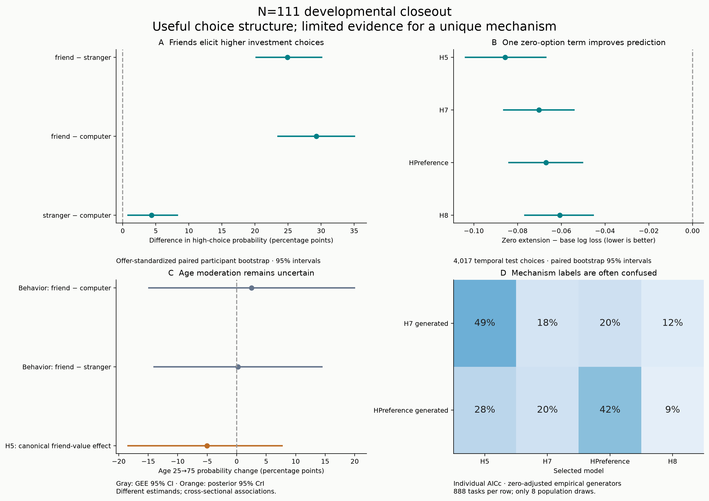

# N=111 developmental-analysis closeout

**N=111 closeout complete.** The fixed sample diagnostics, one generic choice extension and realistic structural recovery are complete. The recovery screen shows insufficiently reliable separation of the leading mechanisms to justify more hierarchical simulations in this closeout. No additional participant data were accessed, and no further sampling is requested.

The fixed primary sample contains 8,442 presented decisions and 8,251 valid choices: 4,234 training and 4,017 held out.

This endpoint supersedes the earlier stage reports as the current synthesis. The original accepted-fit report, caches, thresholds and excluded runs are preserved. This is a developmental analysis of ds005123 v1.1.3, not a preregistered full-sample analysis or proof of structural nonidentifiability.

## 1. What behavioral pattern is robust?

Participants choose higher investments substantially more often with friends. The table uses the primary N=111, averaging offer-specific choice rates equally within each participant before computing paired contrasts. Intervals resample participants; the small stranger–computer contrast should not be given the same evidential emphasis as the friend advantage. Original broad descriptive tables use N=113 and are not substituted for this primary sample.

| contrast | n | difference | ci_low | ci_high |
| --- | --- | --- | --- | --- |
| friend - stranger | 111 | 0.249 | 0.201 | 0.302 |
| friend - computer | 111 | 0.293 | 0.234 | 0.351 |
| stranger - computer | 111 | 0.044 | 0.007 | 0.084 |

## 2. What does hierarchical modeling establish?

The empirical models are jointly fitted, with participant parameters partially pooled through correlated population distributions. Partner-specific models predict held-out choices better than monetary RL: the original no-age H2 log loss is .679, versus approximately .574 for H7/HPreference. H7 and HPreference were nearly tied; predictive gain does not determine whether the effect is reciprocation-specific value or a broader investment preference. New zero-adjusted models also retain hierarchical partial pooling, including one generic participant gamma0 common across partners.

Mean temporal log loss, with each participant weighted equally, is shown below. These are posterior predictive scores for 4,017 held-out choices; training parameters remain fixed while beliefs update from observed prior feedback. Model-selection uncertainty should be assessed with paired comparisons, not these means alone.

| model | variant | mean_log_loss |
| --- | --- | --- |
| H2 | base | 0.6795 |
| H5 | base | 0.6022 |
| H5 | zero | 0.5166 |
| H7 | base | 0.5741 |
| H7 | zero | 0.5039 |
| HPreference | base | 0.5744 |
| HPreference | zero | 0.5074 |
| H8 | base | 0.5911 |
| H8 | zero | 0.5304 |

## 3. What caused the main predictive mismatch?

The strongest discrepancy was structured by zero-containing versus positive-positive offers. Under the accepted no-age training posteriors, held-out zero-minus-positive residual contrasts remain about .18 for friends, .29–.30 for strangers and .20 for computers when using actual feedback histories. The largest conditional-versus-generative difference across held-out partner × offer means is .005252. Thus simulated feedback-history compounding does not explain the main aggregate error. These contrasts do not match investment amounts and do not identify a psychological mechanism.

Add exactly `gamma0 * I(low_option == 0)` to the existing choice logit, shared across partners and not multiplied by kappa. Retain it as a **candidate zero-option avoidance / positive-investment feature**, not a stronger mechanistic label. All four temporal comparisons improve:

| model | metric | mean_delta | ci_low | ci_high |
| --- | --- | --- | --- | --- |
| H5 | log_loss | -0.0856 | -0.1041 | -0.0668 |
| H5 | brier | -0.0366 | -0.0439 | -0.0294 |
| H7 | log_loss | -0.0702 | -0.0866 | -0.0539 |
| H7 | brier | -0.0303 | -0.0369 | -0.0238 |
| HPreference | log_loss | -0.0669 | -0.0842 | -0.0500 |
| HPreference | brier | -0.0290 | -0.0355 | -0.0224 |
| H8 | log_loss | -0.0607 | -0.0770 | -0.0451 |
| H8 | brier | -0.0249 | -0.0319 | -0.0183 |

Negative values favor the extension. Intervals are paired participant-bootstrap 95% intervals conditional on fitted posteriors. Because N=111 diagnostics including test choices motivated the extension, this evaluation remains exploratory rather than untouched confirmatory validation.

Matched full-data no-age mean absolute zero-offer cell residuals drop .211→.030 (H5), .177→.015 (H7), and .173→.018 (HPreference). **The no-damage condition is not uniformly met:** some positive-positive cells worsen, particularly computer trials; H5's mean absolute positive-positive cell error rises .060→.071. Candidate retention therefore carries a residual-misfit qualification. No second extension is added.

The choice feature changes parameter interpretation: median participant posterior-mean theta falls 6.33→2.80 in H5 and 3.84→1.88 in H7; HPreference's friend preference falls 2.29→.91, while kappa increases. These are descriptive changes between fits, not jointly estimated posterior contrasts. They support concern that original partner/value parameters partly compensated for omitted choice structure.

## 4. What remains ambiguous mechanistically?

The finite screen completed 72 full N=111 simulated datasets, all 7,992 participant cases and 63,936 full/training candidate fits, with 32 starts each and no unresolved optimizer errors. It used accepted posterior population hyperparameter draws, new correlated participant effects, and the actual task schedules/missingness. Zero-adjusted models were primary; originals were secondary. Each empirical generator used eight balanced population draws, not 888 independent population draws.

Empirical generating friend theta reached 12.66 in zero-adjusted H5 and 22.61 in base H5. Separate stress datasets deliberately assigned friend theta in 5–10 and 10–20. The shared theta fitting bound expanded to 24.87, above every realized generator; kappa extended to 100 and signed preference to ±24.87. Generators were not clipped. Stress interventions are not posterior draws and are never pooled with empirical simulations.

Primary zero-adjusted, empirical-generating selection rates:

### Participant-level AICc

| generating | H5 | H7 | HPreference | H8 |
| --- | --- | --- | --- | --- |
| H7 | 0.4938 | 0.1796 | 0.2033 | 0.1233 |
| HPreference | 0.2832 | 0.1993 | 0.4234 | 0.0940 |

### Dataset-level AICc

| generating | H5 | H7 | HPreference | H8 |
| --- | --- | --- | --- | --- |
| H7 | 0.0000 | 0.2500 | 0.7500 | 0.0000 |
| HPreference | 0.0000 | 0.0000 | 1.0000 | 0.0000 |

Participant rates pool 888 simulated tasks per generating mechanism across eight population draws. Whole-dataset rates are based on only eight N=111 datasets and sum individual AICc values; they are not hierarchical marginal likelihoods.

H7 was selected in only 2/8 H7-generated datasets by AICc; HPreference was selected in the other 6/8. HPreference was selected in all 8/8 HPreference-generated datasets. This asymmetry is not reliable separation of both mechanisms. BIC selected H7 in 2/8 H7 datasets, HPreference in 3/8 and H5 in 3/8. Individual AICc also confused H7 with H8 in 12.3% of cases, and HPreference with H8 in 9.4%; confusion with simpler H5 was larger. Separate high-theta H7 stress still selected H7 in only one of two datasets and HPreference in the other, in each family. Two stress replicates cannot establish a precise rate.

Temporal MLE rankings are particularly unstable. Whole-dataset log loss selected H5 in 5/8 and H8 in 3/8 H7-generated datasets; for HPreference generators it selected H5 in 6/8 and H8 in 2/8. This does **not** establish superior mechanistic truth of H5/H8: independent short-task training fits frequently hit boundaries and make extremely confident wrong predictions. In the primary empirical screen the largest participant mean test loss is about 727.9. The correctly specified H7 fit hits some parameter boundary in 69.5% of full and 78.8% of training cases; for correctly specified HPreference these rates are 51.1% and 65.5%. Many starts reach comparable optima, so numerical convergence does not resolve weak estimation. AICc/BIC also deserve caution where regularity assumptions fail at boundaries.

**Decision: do not launch hierarchical confirmation in this scoped closeout.** The fast screen fails to show robust, criterion-consistent H7/HPreference separation, and the user brief explicitly stops expensive confirmation when confusion is strong. This is a limitation of the present recovery evidence and estimation scheme, not proof that every possible hierarchical analysis or task design must fail. Strong mechanistic labels are not justified by the current data/model comparison. Preserve reciprocation value, generic partner preference and asymmetric learning as competing accounts; do not infer a unique social-reward mechanism.

## 5. What can N=111 say about age?

Existing age results remain unchanged; no additional age parameterizations, groups, interactions or power simulations were run. Cross-sectional age-25-to-75 changes in high-choice probability:

| contrast | estimate | ci_low | ci_high |
| --- | --- | --- | --- |
| friend - computer | 0.025 | -0.150 | 0.201 |
| friend - stranger | 0.002 | -0.141 | 0.146 |

The accepted H5 canonical friend-value probability effect changes by -0.050, with posterior 95% credible interval [-0.185, 0.078]. This is a model-implied effect at standardized conditions, not the observed friend–computer contrast. These intervals admit meaningful effects in either direction; they do not establish absence of age moderation. H5 latent age-variance fractions are not percentages of total behavioral variability.

## Ratings and excluded runs

Ratings are available for 103 primary participants, but pre/post timing remains unresolved from the available files. Ratings-dependent models stay secondary. H4_full_age and H5_train_age remain excluded; no further attempts were made to obtain 34/34 accepted original fits. The original zero-option HPreference depth-12 attempt remains excluded, with only its explicitly reviewed, accepted depth-14 replacement used in the final comparison. Passing sampler checks do not establish model adequacy.

## Final figures and reproducibility

1. [Where the models miss](figures/01_where_models_miss.png): partner × exact offer.
2. [Conditional versus generative](figures/02_conditional_vs_generative.png): actual versus simulated history residuals.
3. [Zero-option comparison](figures/03_zero_option_comparison.png): accepted matched PPCs and paired temporal gain.
4. [Targeted recovery](figures/04_realistic_recovery.png): primary empirical confusion, individual and dataset levels.
5. [N=111 synthesis](figures/05_n111_synthesis.png): behavior, prediction, age uncertainty and mechanism confusion.

Each has PNG, vector PDF and SVG versions in [figures](figures/). Required machine-readable results are in [tables](tables/), including predictive_residuals.csv, conditional_vs_generative.csv, zero_option_model_comparison.csv, zero_option_parameter_summary.csv, realistic_model_recovery.csv, realistic_model_recovery_confusion.csv and n111_conclusions.csv. Additional audits expose parameter-boundary rates and extreme test-loss tails.

Run `python scripts/26_finalize_n111.py` from the repo root to rebuild this synthesis without posterior sampling or Linux raw chains. The builder independently reconstructs every confusion rate, checks simulation coverage and temporal splits, verifies AICc/BIC formulae and nested likelihoods, recomputes paired zero-option comparisons, and checks accepted generator fingerprints and range coverage. Local validation uses committed per-case outputs and Linux chain-audit hashes; it does not re-read unavailable Linux raw draws. [Provenance](closeout_provenance.json) records inputs and checks, and [closeout status](closeout_status.json) records the stopping decision. The earlier accepted-fit report and phase-specific reports remain historical evidence.

[Decision and handoff record](../../docs/n111_wrapup_decisions.md) · [Recovery protocol](../../docs/n111_realistic_recovery.md) · [Detailed feature decision](zero_option_decision.md).

## What should carry forward to the full dataset

Carry forward the robust friend-related behavior, fixed task/feedback conventions, correlated partial pooling, separate actual-history and generative checks, and the common zero-option term as a candidate needing independent evaluation. Treat raw value/preference estimates as sensitive to choice specification. Preserve competing mechanism explanations and the demonstrated recovery limitations, including boundary-sensitive short-task prediction. Keep age uncertainty explicit and resolve ratings timing before stronger ratings-based inference. This is a descriptive handoff, not a new analysis plan: no additional participants have been accessed or authorized for this phase.
