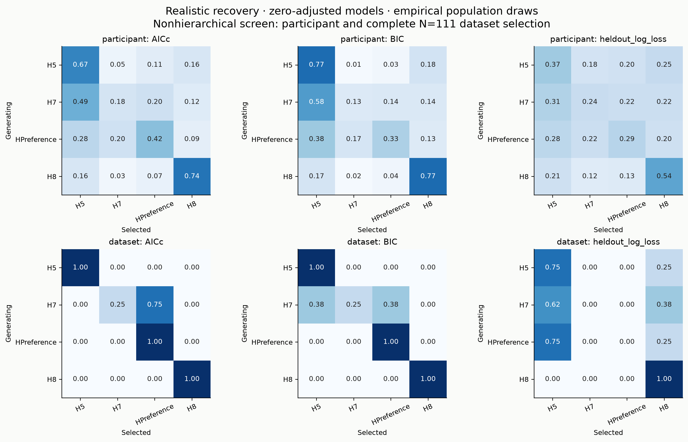

# N=111 realistic mechanism recovery: fast structural screen

7992/7992 participant simulations have all four full/training candidate fits accepted by the optimizer checks. Complete screen: True. No hierarchical fits were launched.

Population parameters come from joint posterior hyperparameter draws, with new correlated participant effects on the actual 111 schedules. Primary zero-adjusted and secondary base families are separate. High-theta stress deliberately intervenes on friend theta (half 5–10, half 10–20); it is not a joint posterior draw and is never pooled with empirical simulations. Generators are never clipped; fitting bounds expand above the realized upper tail.

Participant rows describe selection from one short task. Dataset rows sum individual AICc/BIC or average participant held-out losses across all 111 participants; these are nonhierarchical aggregate choices, not hierarchical model comparisons. Ties within 1e-6 receive fractional weights. Eight empirical population draws per generator limit population-level Monte Carlo precision; participant selections within a replicate are dependent through shared hyperparameters. No binomial confidence intervals treating them as independent are used. Dataset summaries exclude incomplete replicates.

| unit | metric | generating | fitted | selection_probability | n_units |
| --- | --- | --- | --- | --- | --- |
| dataset | AICc | H7 | H5 | 0.0000 | 8 |
| dataset | AICc | H7 | H7 | 0.2500 | 8 |
| dataset | AICc | H7 | H8 | 0.0000 | 8 |
| dataset | AICc | H7 | HPreference | 0.7500 | 8 |
| dataset | AICc | HPreference | H5 | 0.0000 | 8 |
| dataset | AICc | HPreference | H7 | 0.0000 | 8 |
| dataset | AICc | HPreference | H8 | 0.0000 | 8 |
| dataset | AICc | HPreference | HPreference | 1.0000 | 8 |
| dataset | BIC | H7 | H5 | 0.3750 | 8 |
| dataset | BIC | H7 | H7 | 0.2500 | 8 |
| dataset | BIC | H7 | H8 | 0.0000 | 8 |
| dataset | BIC | H7 | HPreference | 0.3750 | 8 |
| dataset | BIC | HPreference | H5 | 0.0000 | 8 |
| dataset | BIC | HPreference | H7 | 0.0000 | 8 |
| dataset | BIC | HPreference | H8 | 0.0000 | 8 |
| dataset | BIC | HPreference | HPreference | 1.0000 | 8 |
| dataset | heldout_brier | H7 | H5 | 0.2500 | 8 |
| dataset | heldout_brier | H7 | H7 | 0.6250 | 8 |
| dataset | heldout_brier | H7 | H8 | 0.0000 | 8 |
| dataset | heldout_brier | H7 | HPreference | 0.1250 | 8 |
| dataset | heldout_brier | HPreference | H5 | 0.0000 | 8 |
| dataset | heldout_brier | HPreference | H7 | 0.6250 | 8 |
| dataset | heldout_brier | HPreference | H8 | 0.0000 | 8 |
| dataset | heldout_brier | HPreference | HPreference | 0.3750 | 8 |
| dataset | heldout_log_loss | H7 | H5 | 0.6250 | 8 |
| dataset | heldout_log_loss | H7 | H7 | 0.0000 | 8 |
| dataset | heldout_log_loss | H7 | H8 | 0.3750 | 8 |
| dataset | heldout_log_loss | H7 | HPreference | 0.0000 | 8 |
| dataset | heldout_log_loss | HPreference | H5 | 0.7500 | 8 |
| dataset | heldout_log_loss | HPreference | H7 | 0.0000 | 8 |
| dataset | heldout_log_loss | HPreference | H8 | 0.2500 | 8 |
| dataset | heldout_log_loss | HPreference | HPreference | 0.0000 | 8 |
| participant | AICc | H7 | H5 | 0.4938 | 888 |
| participant | AICc | H7 | H7 | 0.1796 | 888 |
| participant | AICc | H7 | H8 | 0.1233 | 888 |
| participant | AICc | H7 | HPreference | 0.2033 | 888 |
| participant | AICc | HPreference | H5 | 0.2832 | 888 |
| participant | AICc | HPreference | H7 | 0.1993 | 888 |
| participant | AICc | HPreference | H8 | 0.0940 | 888 |
| participant | AICc | HPreference | HPreference | 0.4234 | 888 |
| participant | BIC | H7 | H5 | 0.5783 | 888 |
| participant | BIC | H7 | H7 | 0.1340 | 888 |
| participant | BIC | H7 | H8 | 0.1447 | 888 |
| participant | BIC | H7 | HPreference | 0.1430 | 888 |
| participant | BIC | HPreference | H5 | 0.3773 | 888 |
| participant | BIC | HPreference | H7 | 0.1695 | 888 |
| participant | BIC | HPreference | H8 | 0.1273 | 888 |
| participant | BIC | HPreference | HPreference | 0.3260 | 888 |
| participant | heldout_brier | H7 | H5 | 0.2958 | 888 |
| participant | heldout_brier | H7 | H7 | 0.2592 | 888 |
| participant | heldout_brier | H7 | H8 | 0.1749 | 888 |
| participant | heldout_brier | H7 | HPreference | 0.2701 | 888 |
| participant | heldout_brier | HPreference | H5 | 0.2252 | 888 |
| participant | heldout_brier | HPreference | H7 | 0.2652 | 888 |
| participant | heldout_brier | HPreference | H8 | 0.1723 | 888 |
| participant | heldout_brier | HPreference | HPreference | 0.3373 | 888 |
| participant | heldout_log_loss | H7 | H5 | 0.3133 | 888 |
| participant | heldout_log_loss | H7 | H7 | 0.2418 | 888 |
| participant | heldout_log_loss | H7 | H8 | 0.2225 | 888 |
| participant | heldout_log_loss | H7 | HPreference | 0.2223 | 888 |
| participant | heldout_log_loss | HPreference | H5 | 0.2807 | 888 |
| participant | heldout_log_loss | HPreference | H7 | 0.2208 | 888 |
| participant | heldout_log_loss | HPreference | H8 | 0.2047 | 888 |
| participant | heldout_log_loss | HPreference | HPreference | 0.2938 | 888 |

Review H7↔HPreference confusion, H8 selections, paired prediction differences, boundary rates and stress results before deciding whether a small hierarchical confirmation is useful. No arbitrary selection-rate cutoff establishes identifiability. Strong confusion is a result, not authorization for additional fits. Final scientific interpretation and N=111 synthesis remain pending.
