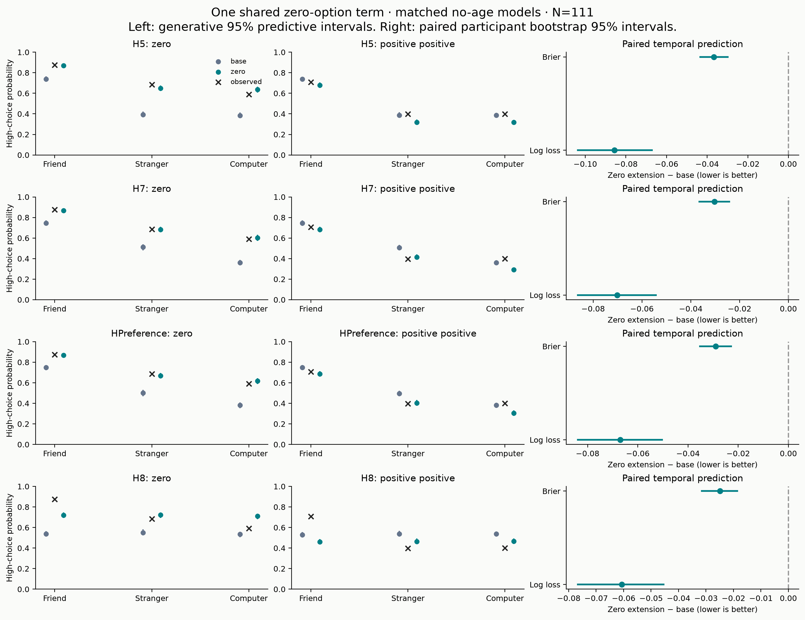

# Zero-option decision after the accepted HPreference retry

**Retain the single shared zero-option term as a candidate feature for the larger sample, with unresolved residual misfit.** This is not a declaration that the model is fully adequate or that a particular psychological mechanism has been identified. No further choice extension is added in this closeout.

Source results: `cf9b33d`. All twelve required comparison sources pass the unchanged diagnostic gate. The isolated HPreference full-data depth-14 retry has Rhat max 1.00446, bulk ESS min 727.878, tail ESS min 1888.57, zero divergences, zero depth hits and BFMI min .6447. It finished in about 2 h 34 min. Its original depth-12 failed attempt remains preserved and excluded, as do H4_full_age and H5_train_age.

## Temporal prediction

The four training extensions predict the same 4,017 held-out choices in 111 participants as their original no-age baselines. Negative differences favor the extension; intervals are paired participant-bootstrap 95% intervals conditional on fitted posteriors.

| model | metric | mean_delta | ci_low | ci_high |
| --- | --- | --- | --- | --- |
| H5 | log_loss | -0.08563 | -0.10409 | -0.06675 |
| H5 | brier | -0.03664 | -0.04386 | -0.02938 |
| H7 | log_loss | -0.07017 | -0.08662 | -0.05392 |
| H7 | brier | -0.03027 | -0.03685 | -0.02384 |
| HPreference | log_loss | -0.06694 | -0.08425 | -0.05001 |
| HPreference | brier | -0.02898 | -0.03552 | -0.02244 |
| H8 | log_loss | -0.06071 | -0.07699 | -0.04511 |
| H8 | brier | -0.02489 | -0.03188 | -0.01834 |

All four improve both measures. The feature was motivated by diagnostics on these same N=111 data, including held-out trials, so this remains exploratory evidence rather than untouched confirmatory validation.

## Absolute fit and the no-damage qualification

Equal-cell mean absolute high-choice residual across the nine partner × exact-offer cells in each class, from matched full-data no-age fits, is shown below. These are descriptive errors, not posterior contrasts or participant-weighted losses.

| model | zero_option | base_mean_absolute_cell_error | zero_mean_absolute_cell_error |
| --- | --- | --- | --- |
| H5 | positive_positive | 0.0599 | 0.0711 |
| H5 | zero | 0.2107 | 0.0298 |
| H7 | positive_positive | 0.0820 | 0.0703 |
| H7 | zero | 0.1770 | 0.0152 |
| H8 | positive_positive | 0.1451 | 0.1236 |
| H8 | zero | 0.1787 | 0.1016 |
| HPreference | positive_positive | 0.0771 | 0.0676 |
| HPreference | zero | 0.1730 | 0.0180 |

For zero-containing offers, error drops from .2107 to .0298 in H5, .1770 to .0152 in H7 and .1730 to .0180 in HPreference. H8 improves less and retains substantial partner misfit. Conditional and generative checks give similar conclusions.

The strict “without worsening positive-positive trials” condition is **not uniformly met**. H5's positive-positive cell error rises .0599→.0711. Although H7 and HPreference improve on average across positive-positive cells, computer positive-positive underprediction grows: .0394→.1089 for H7 and .0189→.0950 for HPreference. Thus candidate retention rests on consistent temporal gain and large zero-offer repair, with this limitation explicitly carried forward. It must not be presented as complete PPC repair. No partner-specific zero feature or other extension is introduced.

## Parameter interpretation changes

The entries below summarize participant posterior means; they are not population-location parameters. Median paired changes need not equal the differences of medians, and no joint posterior uncertainty for a fit-to-fit difference is implied.

| model | parameter | median_base_participant_mean | median_zero_participant_mean | median_paired_change |
| --- | --- | --- | --- | --- |
| H5 | alpha | 0.0892 | 0.0819 | -0.0066 |
| H5 | kappa | 0.1947 | 0.5225 | 0.2241 |
| H5 | theta | 6.3319 | 2.8031 | -4.0862 |
| H7 | alpha | 0.0760 | 0.0596 | -0.0071 |
| H7 | kappa | 0.2918 | 0.6162 | 0.2764 |
| H7 | theta | 3.8388 | 1.8848 | -2.1088 |
| H7 | theta_stranger | 0.9110 | 0.2012 | -0.6014 |
| H8 | alpha | 0.4320 | 0.1535 | -0.1275 |
| H8 | alpha_negative | 0.0775 | 0.1238 | 0.0134 |
| H8 | kappa | 0.3441 | 0.4515 | 0.0668 |
| HPreference | alpha | 0.1604 | 0.1150 | -0.0308 |
| HPreference | kappa | 0.2314 | 0.5298 | 0.2422 |
| HPreference | preference_friend | 2.2866 | 0.9147 | -1.5152 |
| HPreference | preference_stranger | 0.5510 | 0.1458 | -0.3666 |

H5 theta falls 6.33→2.80; H7 friend theta 3.84→1.88; HPreference friend preference 2.29→.91. Kappa increases in all three. Original partner/value parameters partly compensated for omitted choice structure. This strengthens the need for realistic recovery before assigning mechanism labels; it is not proof that social valuation is absent.

## Next finite step

The [recovery protocol](../../docs/n111_realistic_recovery.md) uses the zero-adjusted family primarily and the original family secondarily. It samples accepted posterior population hyperparameters, draws new correlated participant effects, retains the actual N=111 task schedules and missingness, and separately labels high-theta stress. It runs a finite nonhierarchical structural screen with wide fitting bounds and 32 starts, exporting participant- and dataset-level confusion plus temporal differences. It launches no hierarchical sampling automatically.

Realistic recovery and final synthesis remain pending. The accepted behavioral/model age estimates and unresolved ratings timing remain unchanged. No additional participants or imaging are accessed.
