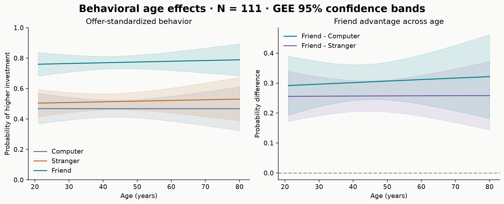
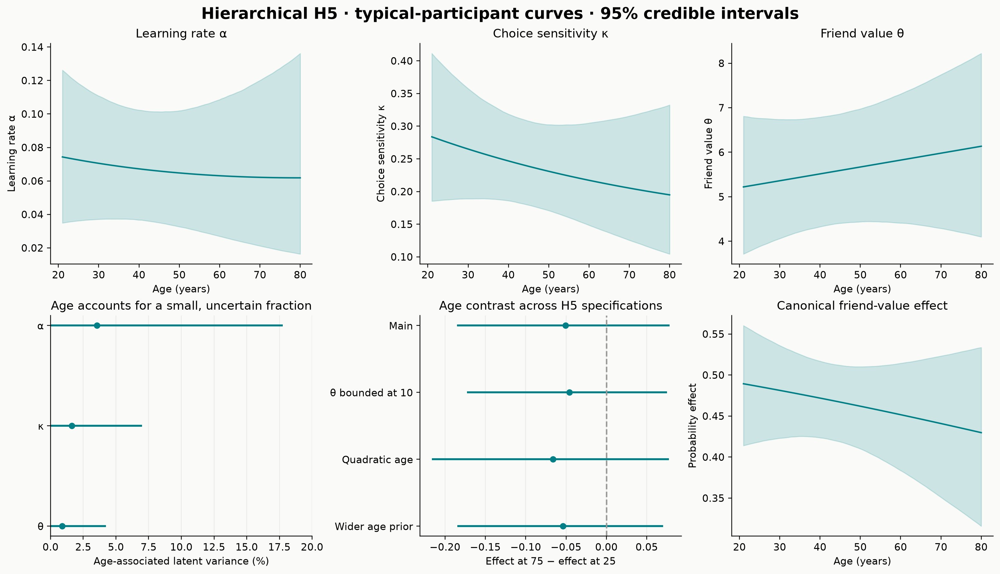
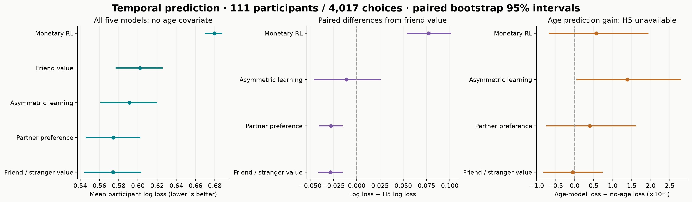
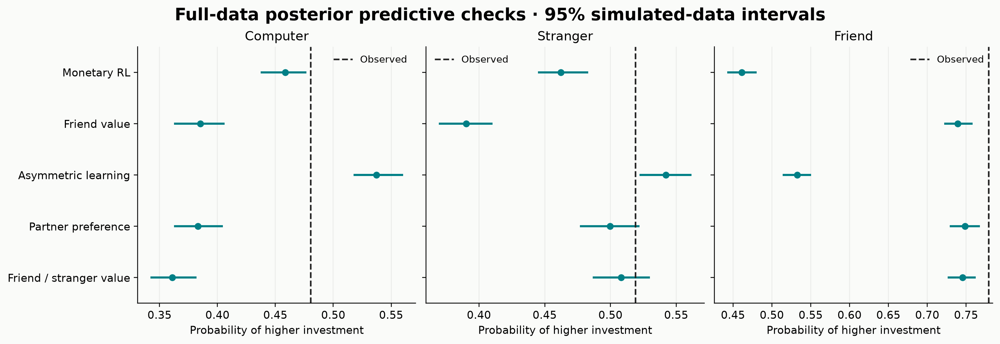
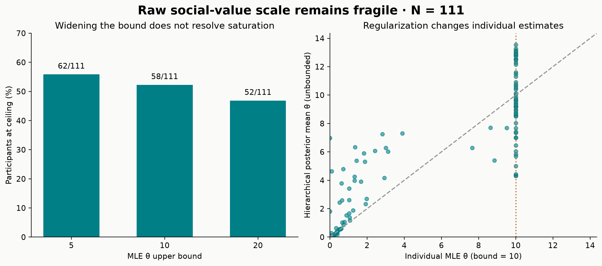
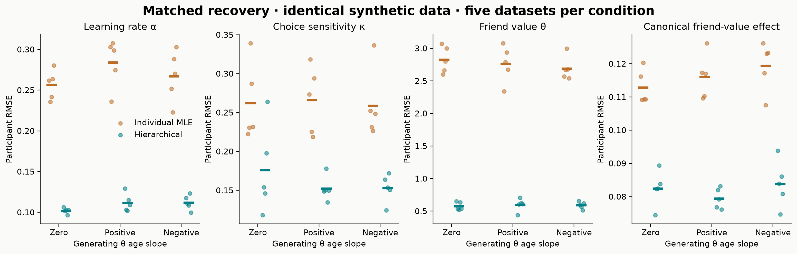

# Accepted-fit review — 25 September 2026

**32 of 34 Linux posterior runs meet the existing diagnostic gate. This is a scoped review, not completion of the full second pass.** H4 full-age inference and H5 age-model held-out scoring are excluded. Their older summary files may still exist elsewhere in the repository; this report never reads them. Primary analyses use N=111 from ds005123 v1.1.3; ratings-dependent H4 would use N=103 and remains secondary because rating timing is unresolved.

The audit found no custom-versus-reference gradient discrepancy at the four tested saved states (maximum scaled error 2.81e-14). The largest population-mean shifts from the previous attempt were 0.050 posterior SD for H4 and 0.023 SD for H5. Recorded states are not the unavailable intermediate trajectory states where the integrator failed. These checks are reassuring about implementation at the tested points; they do not establish that divergences are harmless. The zero-divergence requirement is unchanged, and no further sampling was run to build this report. See the [diagnostic audit](../diagnostic_review/README.md) and [Stan diagnostic guidance](https://mc-stan.org/learn-stan/diagnostics-warnings.html).

| run | status | retained_draws | max_rhat | min_bulk_ess | divergences |
| --- | --- | --- | --- | --- | --- |
| H4_full_age | diagnostic_failed | 16000 | 1.003 | 1656.750 | 1 |
| H5_train_age | diagnostic_failed | 64000 | 1.005 | 1776.700 | 1 |

## What the accepted results show

- **Age explains a small, uncertain fraction of H5 latent parameter variation.** Posterior mean fractions are listed below; all linear age-slope 95% credible intervals include zero. This does not establish absence of age effects. Behavioral friend-advantage changes are also imprecise.
- **Predictive flexibility matters.** The no-age partner preference and separate friend/stranger value models outperform H5 on paired held-out log loss. Their difference from one another is small. This supports useful partner-specific structure without uniquely establishing a social-reward mechanism.
- **Raw θ remains sensitive to constraints.** Even a ceiling of 20 captures many MLEs. Hierarchical regularization improves recovery in the tested simulation regime, which is substantially lower in θ than the empirical estimates.
- **Absolute fit still needs scrutiny.** For H5, observed friend high-choice frequency is 0.779, compared with posterior predictive mean 0.739 and 95% interval [0.722, 0.758]. The computer-partner mismatch is larger: observed 0.480 versus predicted 0.385 [0.362, 0.406].

### How much variability is associated with age?

H5 latent-scale age variance fractions, in percent (posterior mean, median, and 95% credible interval):

| parameter | mean | median | ci_low | ci_high |
| --- | --- | --- | --- | --- |
| alpha | 3.545 | 1.627 | 0.003 | 17.761 |
| kappa | 1.616 | 0.896 | 0.003 | 6.985 |
| theta | 0.885 | 0.428 | 0.001 | 4.239 |

The canonical friend-value probability effect changes by -0.050 from age 25 to 75, with 95% credible interval [-0.185, 0.078]. Its posterior probability of a positive change is 0.225. Bounded θ, quadratic age, and wider age-prior sensitivity fits also have intervals spanning zero. These are joint hierarchical models: participant parameters are partially pooled through correlated population distributions, with age in their population means.

Behavioral changes in the friend advantage from age 25 to 75 (probability units; GEE 95% confidence intervals):

| contrast | estimate | ci_low | ci_high |
| --- | --- | --- | --- |
| friend - computer | 0.025 | -0.150 | 0.201 |
| friend - stranger | 0.002 | -0.141 | 0.146 |

### What predicts new choices?

No-age posterior predictive log loss (lower is better; each participant weighted equally):

| model | mean | ci_low | ci_high |
| --- | --- | --- | --- |
| H2 | 0.679 | 0.670 | 0.688 |
| H5 | 0.602 | 0.577 | 0.626 |
| H8 | 0.591 | 0.561 | 0.620 |
| HPreference | 0.574 | 0.546 | 0.603 |
| H7 | 0.574 | 0.544 | 0.603 |

Paired differences, model minus reference (negative favors the model):

| model | reference | mean | ci_low | ci_high |
| --- | --- | --- | --- | --- |
| H2 | H5 | 0.077 | 0.054 | 0.102 |
| H8 | H5 | -0.011 | -0.046 | 0.026 |
| HPreference | H5 | -0.028 | -0.041 | -0.015 |
| H7 | H5 | -0.028 | -0.041 | -0.015 |
| H7 | HPreference | -0.000 | -0.005 | 0.005 |

Adding age, paired age-minus-no-age loss:

| model | mean | ci_low | ci_high |
| --- | --- | --- | --- |
| H2 | 0.00057 | -0.00068 | 0.00194 |
| H8 | 0.00138 | 0.00005 | 0.00280 |
| HPreference | 0.00039 | -0.00076 | 0.00161 |
| H7 | -0.00005 | -0.00083 | 0.00073 |

H5 age prediction is unavailable because its training-age fit failed diagnostics. No claim about H5’s predictive age gain is supported here. Small changes for the other four models should be read with their paired intervals, not inferred from overlapping marginal score intervals.

### What recovery does and does not establish

The 15 accepted recovery runs were aggregated afresh from per-run files, avoiding the historical aggregate. Mean participant RMSE for θ:

| condition | method | datasets | mean_rmse | mean_coverage |
| --- | --- | --- | --- | --- |
| negative | MLE_theta10 | 5 | 2.691 | — |
| negative | hierarchical | 5 | 0.590 | 0.948 |
| positive | MLE_theta10 | 5 | 2.765 | — |
| positive | hierarchical | 5 | 0.595 | 0.858 |
| zero | MLE_theta10 | 5 | 2.826 | — |
| zero | hierarchical | 5 | 0.576 | 0.969 |

Across these simulations, generating θ has median 1.29 and maximum 4.36; the empirical median participant H5 posterior mean is 6.45. Better recovery here does not validate the empirical high-θ regime. MLE has no interval coverage column because it produces point estimates. Population θ age-slope recovery is based on only five datasets per condition:

| condition | datasets | true_slope | mean_estimate | intervals_excluding_zero | truth_coverage |
| --- | --- | --- | --- | --- | --- |
| negative | 5 | -0.350 | -0.325 | 4 | 1.000 |
| positive | 5 | 0.350 | 0.363 | 4 | 0.800 |
| zero | 5 | 0.000 | 0.080 | 1 | 0.800 |

Participant θ interval coverage is only 0.858 in the positive-age condition despite lower RMSE; improved point recovery does not ensure calibrated uncertainty. The original full model-recovery extension remains deferred. This review does not replace it or claim a unique mechanism.

## Figures

### Behavior and age

Bands are pointwise GEE 95% confidence intervals, standardized over empirical offers. The cross-sectional age association is not an individual aging trajectory.

[Vector PDF](figures/01_behavior_age.pdf)

### Joint hierarchical age effects

Curves transform the population location at each age (zero participant random effect), not the average across all participant random effects. Bands are pointwise 95% posterior credible intervals. The canonical effect turns friend value on versus off at belief P=.5, standardized over empirical offers; it is not the observed friend-minus-computer contrast. Variance fractions are on each parameter’s latent scale, not behavioral R². Sensitivity intervals show the age-75 minus age-25 canonical effect.

[Vector PDF](figures/02_hierarchical_age.pdf)

### Temporal predictive performance

Each participant has equal weight. Intervals are percentile intervals from 5,000 participant bootstrap samples, with seed 20260925; contrasts resample paired scores. These quantify participant sampling variability conditional on fitted models, not posterior credible intervals or refitting uncertainty. All five no-age models use the same 4,017 held-out choices. H5 training-age is excluded. Prediction updates beliefs as feedback arrives while keeping the training parameter posterior fixed.

[Vector PDF](figures/03_heldout.pdf)

### Posterior predictive model checks

Dots and intervals summarize simulated datasets from full-data age models, including posterior uncertainty; dashed lines show observed equal-participant means. A held-out advantage does not ensure adequate absolute fit. Intervals are pointwise descriptive checks across several model/partner combinations.

[Vector PDF](figures/04_predictive_checks.pdf)

### Bounds and hierarchical regularization

The right panel compares different estimators and constraints. Shrinkage and a finite hierarchical estimate do not prove that the individual raw θ parameter is identified.

[Vector PDF](figures/05_theta_identifiability.pdf)

### Matched parameter recovery

Every dot is one complete synthetic dataset (111 participants); short horizontal lines are means across five datasets per condition. The two estimators see identical data. Five datasets per condition are too few for precise calibration or power estimates, and this is not simulation-based calibration.

[Vector PDF](figures/06_recovery.pdf)

## Reproduction and limits

Run `.venv/bin/python scripts/19_build_accepted_review.py` from the repository root. No CmdStan installation, raw posterior draws, or Linux access is needed. The builder checks both live Linux completion status and per-run numerical diagnostics before admitting a hierarchical input. It also checks paired participant identities and trial counts, and records SHA-256 hashes of every input in [provenance.json](provenance.json). Outputs use the committed per-run summaries; posterior extraction itself was performed on Linux and is not repeated here.

[Fit inventory](tables/fit_inventory.csv) · [Age results](tables/h5_age.csv) · [Paired predictions](tables/heldout_paired_contrasts.csv) · [Recovery by dataset](tables/recovery_by_dataset.csv).

Passing sampler diagnostics are necessary checks, not proof of model adequacy or identifiability. Cross-sectional age associations are exploratory. Credible intervals and bootstrap comparisons are pointwise and are not multiplicity-adjusted. Ratings timing remains unresolved. The full second-pass finalizer remains blocked on two fits; the first-pass report/gallery and older aggregate tables are historical rather than the source of this review.
